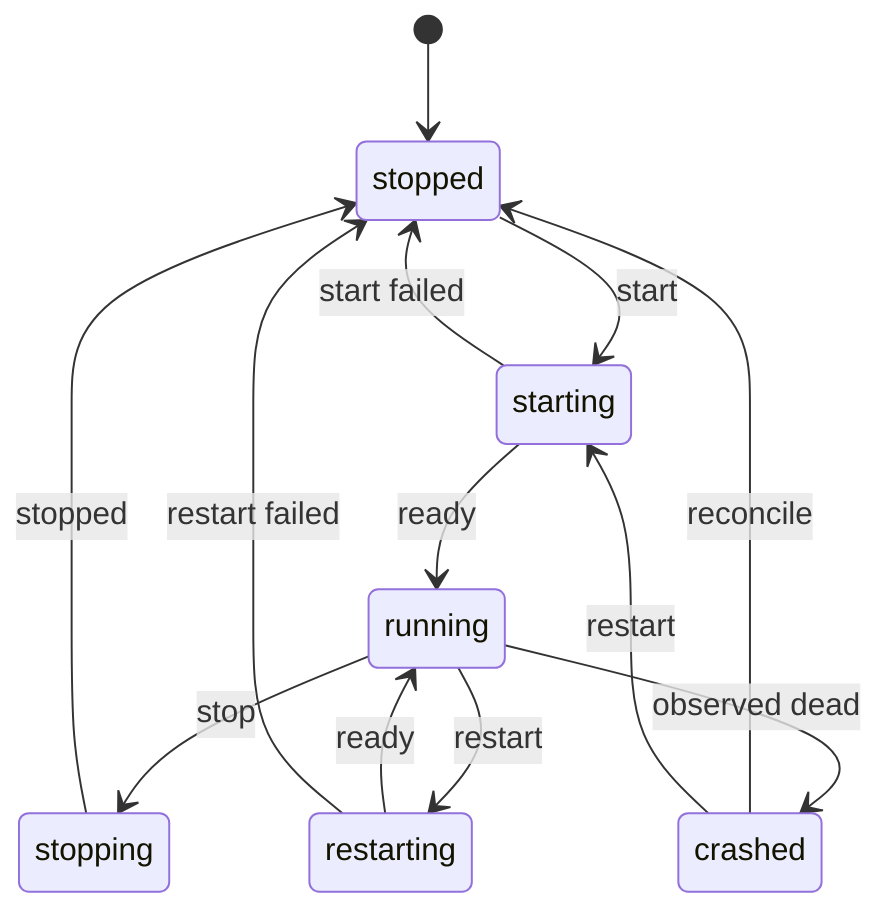
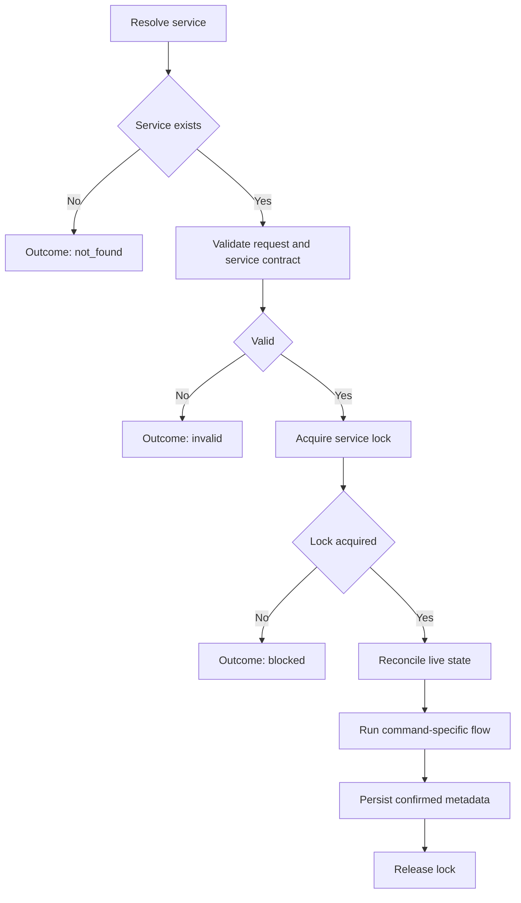
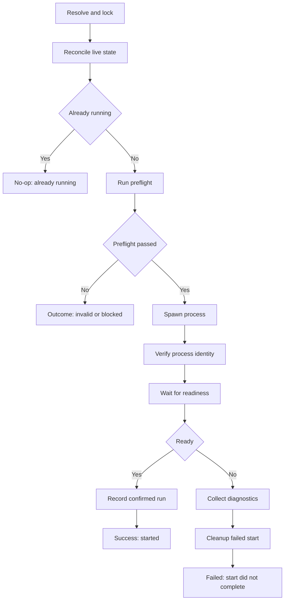
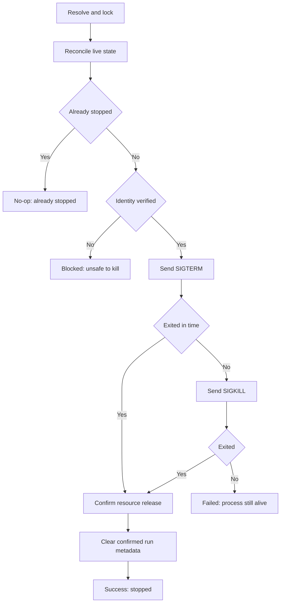
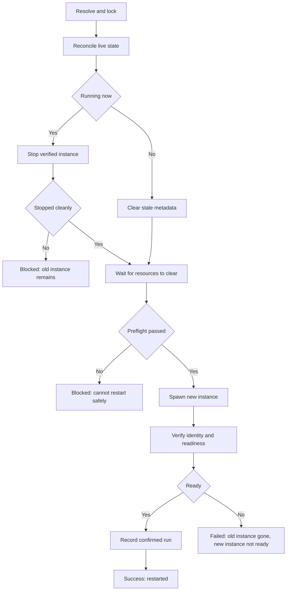
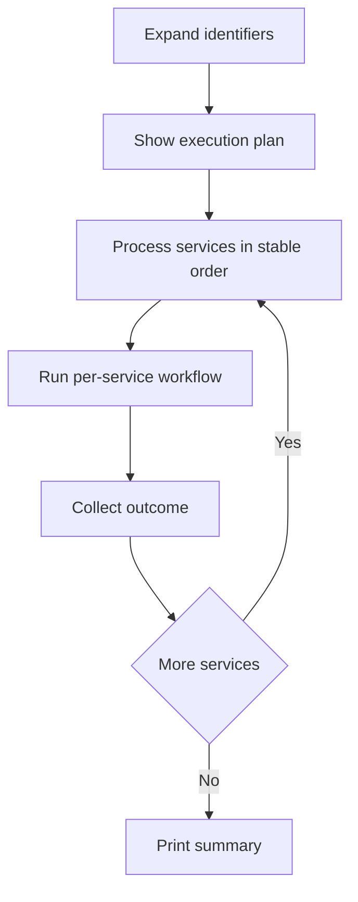

# Process Management Behavioral Contract

Defines the correct workflow and operator-facing behavior for managed service lifecycle operations: `start`, `stop`, `restart`, and batch execution.

This is a process contract, not an implementation note. It defines what must be true before, during, and after each lifecycle action.

This document standardizes the workflow algorithm and operator experience. It is intentionally stricter than the current implementation. Where the implementation is simpler, this document defines the target behavior to converge toward.

---

## 1. Operating Model

### 1.1 Sources of Truth

The system has three different kinds of state:

- **Desired state**: the managed service definition in the registry
- **Observed state**: what the system can prove right now by scanning processes and ports
- **Operation state**: an in-progress lifecycle action owned by exactly one operator flow

The key rule:

> Observed state is authoritative for whether a service is running.  
> Registry state stores configuration and last confirmed ownership metadata.

Because this is a daemonless workflow, the registry cannot be treated as continuously current. A process can die immediately after a successful write. Every command must reconcile live state before acting.

### 1.2 Durable State vs Command Phase

The contract separates persistent service status from command-local execution phase.

Persistent service status is what operators may rely on between commands:

- **running**
- **stopped**
- **crashed**
- **unknown**

Command phase is transient and exists only while a lifecycle command owns the service:

- **starting**
- **stopping**
- **restarting**

Unless the system introduces persisted operation records, command phase is not durable state and must not be shown later as if it were.

### 1.3 Service Identity

A service must never be identified by PID alone.

Identity must be verified using:

- PID
- Process start time when available
- Declared port ownership
- Command fingerprint
- Working directory or project root

If PID reuse is possible and identity cannot be proven, the service must be treated as **unknown**, not **running**.

### 1.4 Operation Ownership

Only one lifecycle operation may own a service at a time.

Before `start`, `stop`, or `restart`, the system must acquire a per-service operation lock.

If the lock cannot be acquired:

- Do not continue optimistically
- Report that another operation is already in progress
- Exit with a blocked result

### 1.5 Registry Write Rule

The registry may store:

- service definition
- last confirmed PID
- last confirmed process start time
- last confirmed readiness timestamp
- last log path or log session metadata

The registry must not be used as the sole proof that a service is alive.

---

## 2. Status, Phase, and Outcomes



### 2.1 Persistent Service Status

- **running**: a live process identity has been verified and readiness has passed when required
- **stopped**: no verified running instance exists
- **crashed**: the last confirmed instance is gone and the tool has evidence of an unexpected exit or stale last-run metadata
- **unknown**: a process may exist, but ownership cannot be proven safely

### 2.2 Command Phase

- **starting**: a start operation owns the service and readiness is being verified
- **stopping**: shutdown is in progress and the current instance may still own resources
- **restarting**: one verified instance is being replaced by another

These are command-local phases, not durable statuses, unless a future operation journal explicitly persists them.

### 2.3 Command Outcomes

Every lifecycle command must end in one of these outcomes:

- **success**: requested state change completed
- **noop**: requested end state already existed
- **blocked**: action was prevented by a lock, conflict, or unsafe ambiguity that may be resolved externally
- **failed**: action was attempted but could not complete
- **invalid**: the request or service definition is invalid
- **not_found**: the requested service identifier matched nothing

This standard replaces vague failure-only reporting with explicit operator-facing outcomes.

### 2.4 Outcome Rules

- use **blocked** for lock contention, identity ambiguity, or external resource conflicts
- use **invalid** for malformed commands, missing working directories, or impossible service definitions
- use **not_found** when resolution fails before any lifecycle work begins
- do not collapse all non-success results into **failed**

---

## 3. Universal Workflow

Every lifecycle operation must follow the same high-level algorithm.



### 3.1 Reconcile Live State

Before any mutation:

- scan current listeners and processes
- match live processes against managed services by identity, not just PID
- clear stale metadata that can no longer be verified
- classify the service as `running`, `stopped`, `crashed`, or `unknown`

If the service is `unknown`, the system must not take destructive action until identity is clarified.

### 3.2 Lock Protocol

Per-service locking must follow these rules:

- lock scope is one managed service identifier
- lock owner records command type and acquisition timestamp
- lock acquisition is exclusive
- stale locks must be recoverable by timeout or explicit verification that the owner is gone
- batch operations acquire and release one service lock at a time unless a higher-level planner is explicitly introduced

If a lock cannot be acquired safely, return `blocked` and do not continue optimistically.

### 3.3 Persist Only Confirmed Facts

Write registry metadata only after a fact has been confirmed:

- do not record a PID before the child is proven alive
- do not mark a service running before readiness passes
- do not clear stop metadata until the process is confirmed gone

### 3.4 Identity Verification Algorithm

Identity verification must use ordered evidence, not ad hoc matching.

Preferred evidence order:

1. exact working directory match
2. exact project root match
3. declared port owned by exactly one plausible managed service
4. stored PID plus matching path evidence
5. command fingerprint as a supporting signal, never as sole proof

Verification rules:

- at least one path-based or uniquely-owned port-based signal must exist
- PID alone is never sufficient
- command string alone is never sufficient
- if multiple managed services remain plausible after matching, classify as `unknown`
- if evidence conflicts, prefer safety over convenience and classify as `unknown`

---

## 4. Start

### 4.1 Start Flow



### 4.2 Start Rules

- `start` is end-state oriented: its job is to ensure the service is running
- if a verified instance is already running, return `noop`
- if a stale registry entry exists, clear it during reconciliation before any fork
- if identity is ambiguous, return `blocked`
- never spawn a second instance just because the registry is stale

### 4.3 Preflight Requirements

Before any fork:

- working directory exists and is a directory
- command parses into an executable and arguments
- executable can be resolved
- all declared ports are free, or are already owned by the same verified instance
- required files or env assumptions are present when the service contract requires them

Preflight failures caused by invalid service definition return `invalid`.

Preflight failures caused by external contention, such as port conflicts, return `blocked`.

### 4.4 Readiness Policy

Readiness is a service policy, not an ad hoc runtime guess.

Allowed readiness modes:

- **process-only**: child remains alive for the startup window
- **port-bound**: declared port is bound by the verified child
- **http-health**: HTTP readiness endpoint returns success
- **log-signal**: a declared log pattern appears
- **multi-check**: more than one condition must pass

If the service model supports explicit readiness configuration, the service definition must declare which mode applies.

If no explicit readiness policy exists yet, the fallback policy is:

- `port-bound` for services with declared ports
- `process-only` for services without declared ports

This fallback is transitional. A future richer service contract may replace it.

### 4.5 Start Failure Handling

If start fails:

- collect a short diagnostic summary
- include log tail when available
- kill the child if it is still alive but not ready
- do not write unconfirmed PID data
- return `failed`

### 4.6 Required Message Format

Start messages must use decisive operator language and must state the resolved outcome.

- `Success: started "api" on port 3000 (PID 4821).`
- `No-op: "api" is already running on port 3000 (PID 4821).`
- `Blocked: port 3000 is in use by PID 4821 (python). Stop it or change the service port.`
- `Invalid: "api" has a missing working directory: /path/to/project.`
- `Failed: "api" did not become ready within 5s. Check logs with devpt logs api.`

---

## 5. Stop

### 5.1 Stop Flow



### 5.2 Stop Rules

- `stop` is idempotent: if the service is already stopped, return `noop`
- if the registry contains stale metadata and no verified live instance exists, clear the stale data and return `noop`
- never kill a process when service identity is ambiguous
- terminate gracefully first, then escalate
- confirm that the process is gone before clearing ownership metadata
- if service status is `unknown`, refuse destructive action and return `blocked`

### 5.3 Stop Failure Handling

If forced kill fails:

- report the PID and why termination failed
- tell the operator whether elevated permissions may be required
- leave the service in `blocked` or `failed`, not falsely `stopped`

### 5.4 Required Message Format

Stop messages must state whether the final state is already satisfied, blocked, or failed.

- `Success: stopped "worker" (PID 3105).`
- `No-op: "worker" is already stopped.`
- `No-op: stale PID 3105 was cleared for "worker".`
- `Blocked: PID 3105 cannot be proven to belong to "worker"; refusing to kill.`
- `Failed: PID 3105 did not exit after SIGTERM and SIGKILL. Sudo may be required.`

---

## 6. Restart

### 6.1 Restart Flow



### 6.2 Restart Rules

- `restart` means replace the current instance with a fresh verified instance
- the old instance must be confirmed gone before the new one is accepted
- if the old instance cannot be stopped, return `blocked`
- if the old instance is already gone, clean stale metadata and continue
- if start fails after stop succeeds, report that the service is now stopped, not running
- if the service was already stopped, the operator-facing message must say that restart resolved as a fresh start

### 6.3 Freshness Rule

When a previous instance existed, the new confirmed run must differ by identity from the old one. A restart that simply rediscovers the same old instance is not a valid restart.

### 6.4 Required Message Format

- `Success: restarted "api" with a fresh instance (old PID 3105, new PID 4821).`
- `Success: started "worker" because no verified instance was running.`
- `Blocked: could not restart "web" because the old instance still owns port 3000.`
- `Failed: "api" was stopped, but the replacement instance did not become ready.`

---

## 7. Batch Operations

Batch commands must optimize operator clarity, not just throughput.

### 7.1 Batch Flow



### 7.2 Batch Rules

- expand patterns before execution
- deduplicate matches
- process services in a stable and predictable order
- continue after per-service failures unless the command explicitly declares fail-fast behavior
- return non-zero if any service failed
- distinguish `success`, `noop`, `blocked`, `failed`, `invalid`, and `not_found` in the summary

### 7.3 Dependency-Aware UX

If services have declared dependencies, the batch planner must:

- start dependencies before dependents
- stop dependents before dependencies
- restart in dependency-aware order

If dependency data is unavailable, the batch planner must use a stable deterministic order and report that dependency ordering was unavailable.

Dependency ordering is an extension policy. If the service model does not yet carry dependency data, the batch system must not invent it.

### 7.4 Summary Format

The batch summary must report:

- total matched
- succeeded
- noop
- blocked
- failed
- invalid
- not found
- per-service reason for every non-success outcome

Example:

```text
Matched 4 services
2 succeeded, 1 noop, 1 blocked

- api: started
- worker: started
- web: already running
- redis: port 6379 is in use by PID 4821
```

---

## 8. Error Reporting

All lifecycle messages must answer three questions:

- what was attempted
- what actually happened
- what the operator must do next

Bad:

- `failed to start`
- `process error`

Good:

- `Blocked: port 9055 is in use by PID 4821 (python). Stop that process or change the service port.`
- `Failed: "api" exited during startup before binding port 9055. Recent logs are available via devpt logs api.`
- `Invalid: "worker" has an invalid command definition.`
- `Blocked: another restart is already in progress for "worker". Retry after it completes.`

---

## 9. Non-Negotiable Rules

- never trust registry PID data without live reconciliation
- never identify a service by PID alone
- never record a run before identity and readiness are confirmed
- never kill a process whose identity is ambiguous
- never report `running` unless observed state proves it
- never report `stopped` until shutdown is confirmed
- never hide stale metadata cleanup
- never let concurrent operations mutate the same service without a lock
- never present transient command phase as durable service state unless operation records exist

These rules exist to protect operator trust. Once the tool lies about lifecycle state, every downstream command becomes unreliable.
